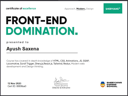

---

# 🌐 Sheryians Web Page – Cohort 2.0 Landing Page

This project is a **fully responsive landing page** built using **HTML & CSS** for **Sheryians Coding School – Cohort 2.0**.
It highlights the **AI-powered job-ready program**, including features, student success, syllabus details, and pricing.

---

## 📂 Project Structure

```
Sheryians-WebPage/
│
├── index.html        # Main HTML file (landing page)
├── style.css         # Stylesheet for layout, colors, and responsiveness
├── assets/           # Images, certificates, and other resources
│   ├── Cert.png
│   └── fonts/
│       ├── Helvetica_NTUXwLmxSC.ttf
│       ├── Gilroy-Medium_eHDK2RllDd.ttf
│       └── NeueMachina-Regular_DQCmjH1st.ttf
```

---

## 🎨 Features Implemented

### ✅ Navigation Bar

* Logo + branding
* Multiple sections (`Home`, `Course`, `Cohort 2.0`, `Classroom`, etc.)
* Responsive design with mobile menu icons (`menu` & `phone` from Remix Icons)
* Glassmorphism effect using **backdrop-filter: blur()**

### ✅ Hero Section

* Cohort 2.0 title with highlights (MERN Stack, DSA, AI Powered, Aptitude & Reasoning).
* Pricing details with **call-to-action buttons** (`Buy Now`, `View Syllabus`).
* Course preview card with schedule, language, certification, and hours.

### ✅ Placement Highlight

* Animated **“Get Placed”** section with gradient text.
* Illustrative graphic showcasing job-ready focus.

### ✅ Comparison Section (What’s New?)

* Side-by-side comparison of **Sheryians vs Others**.
* Key highlights like **AI exposure, Placement prep, Portfolio guidance**.

### ✅ Student Wall of Fame

* Grid of real student success stories with images.
* Celebrates community wins.

### ✅ Curriculum Overview

* Expandable sections (AI, Generative AI, etc.).
* **Icons via RemixIcon** for modern visuals.

### ✅ Value-Added Sections

* Industry-ready courses (Full Stack, DSA, Freelancing, UI/UX).
* Certification section with motivational message.
* Scratch card section for discounts 🎉.

### ✅ FAQ Section

* Commonly asked questions with expandable answers.

### ✅ Footer

* Social links (Instagram, LinkedIn, Discord, YouTube, X/Twitter).
* Company details (Privacy Policy, Terms, Support, etc.).
* Contact information with address.

---

## 🎨 Styling Highlights

* **CSS Variables** for consistent theme (`--green`, `--gray`, `--black`, `--white`).
* Custom **fonts** (`Helvetica`, `Gilroy`, `Neue Machina`) for a professional look.
* **Glassmorphism Navigation Bar** with blur effects.
* **Gradient + background clipping** for stylish text sections.
* Fully **responsive layout** using Flexbox & Grid.

---

## 🚀 How to Run

1. Clone the repository or download the files.

   ```bash
   git clone https://github.com/your-username/Sheryians-WebPage.git
   cd Sheryians-WebPage
   ```

2. Open `index.html` in any modern browser.

3. That’s it 🎉 – no build setup required!

---

## 🛠️ Tech Stack

* **HTML5** – Semantic structure
* **CSS3** – Flexbox, Grid, Variables, Animations, Gradients
* **Remix Icons** – Modern icons
* **Custom Fonts** – Better typography

---

## 📸 Screenshots

| Section       | Preview                                                             |
| ------------- | ------------------------------------------------------------------- |
| Hero Section  |    |
| Student Wall  |  |
| Certification |                                           |

---

## 🌟 Learnings from This Project

* How to create **responsive layouts** with Flexbox & Grid.
* Implementing **glassmorphism effects** with CSS.
* Using **gradient clipping & background effects** for text.
* Structuring a **professional landing page** with multiple sections.
* Using **custom fonts** & variables for consistent branding.

---

## 🔗 Live Demo

👉 [View Website](#) *(Add GitHub Pages / Vercel / Netlify link here once deployed)*

---

## 🤝 Connect

💡 Built with passion while learning modern web design concepts.
📩 Feel free to connect with me on [LinkedIn](https://linkedin.com) for feedback and collaboration.

---

✨ *This project is part of my ongoing web development journey to sharpen skills in HTML, CSS, and responsive design.*

---

Would you like me to also **add a short LinkedIn-friendly post (2–3 paragraphs)** that you can directly paste along with this `README.md` when you share it?
